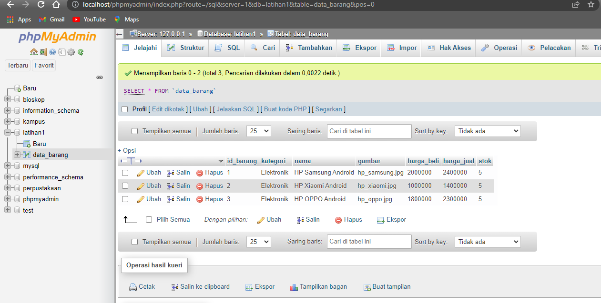
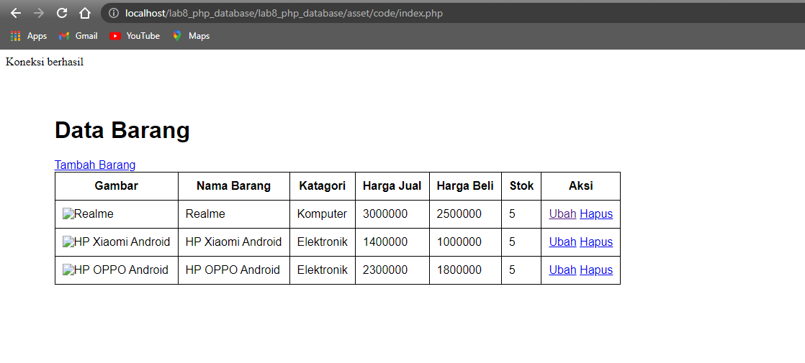

| Nama      | Dimas Riyadh Alfajri |
| ----------- | ----------- |
| NIM     | 312010029       |
| Kelas   | TI.20.A.1        |

## Praktikum 8

## Langkah-langkah praktikum

## 1. Menjalankan MySQL Server

Untuk menjalankan MySQL Server dari menu XAMPP Control.

### Mengakses MySQL Client menggunakan PHP MyAdmin

Pastikan webserver Apache dan MySQL server sudah dijalankan. Kemudian untuk mengakses direktory tersebut pada web server dengan mengakses URL : http://localhost/phpmyadmin/

## 2.Membuat Database: Studi Kasus Data Barang

### Membuat database

### Menambahkan Data

## Membuat Program CRUD

Buat folder lab8_php_database pada root directory web server (/Application/xampp/htdocs)

Kemudian untuk mengakses direktory tersebut pada web server dengan mengakses URL: http://localhost/lab8_php_database/

## Membuat file koneksi database

Buat file baru dengan nama koneksi.php

Buka melalui browser untuk menguji koneksi database (untuk menyampilkan pesan koneksi berhasil, uncomment pada perintah echo “koneksi berhasil”;

## Membuat file index untuk menampilkan data (Read)

Buat file baru dengan nama index.php

## Menambah Data (Create)

Buat file baru dengan nama tambah.php

## Mengubah Data (Update)

Buat file baru dengan nama ubah.php

## Menghapus Data (Delete)

Buat file baru dengan nama hapus.php

Sebelum di hapus

Sesudah di hapus 

